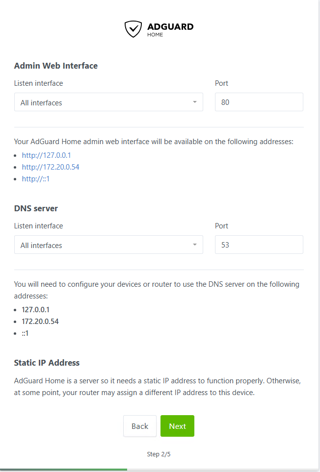
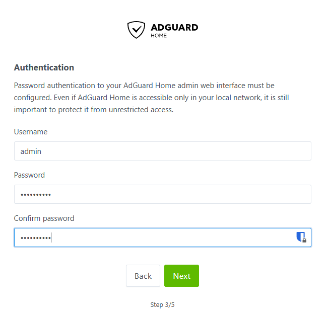

# AdGuard Home with Unbound
## What is Adguard Home with Unbound

AdGuard Home with Unbound is a powerful combination for setting up a privacy-focused DNS solution in a home network. Let me break it down:

### **AdGuard Home**

AdGuard Home is an all-in-one network-wide ad and tracker blocking solution. When you run it on your network (typically via a Raspberry Pi, a dedicated server, or a Docker container), it acts as a DNS server that filters out ads, trackers, and malicious content at the DNS level before they can even load on your devices. Essentially, all your devices benefit from ad-blocking without needing individual ad-blocker setups.

**Key features of AdGuard Home:**

* **DNS-based ad-blocking**: Blocks ads before they load, reducing traffic and enhancing browsing speed.
* **Parental controls**: Filter content to prevent access to inappropriate websites.
* **Privacy protection**: Blocks trackers that follow you across the web.
* **Custom DNS filtering rules**: You can set up specific rules for blocking or allowing certain domains.

### **Unbound**

Unbound is a DNS resolver that enhances privacy and security. When used with AdGuard Home, it works as a recursive DNS resolver. Rather than relying on public DNS providers (like Google DNS or Cloudflare DNS), Unbound resolves domain names directly by querying the root DNS servers and authoritative servers, giving you more control and privacy.

**Key features of Unbound:**

* **Full DNS resolution**: Instead of relying on third-party DNS resolvers, Unbound queries DNS servers directly from the root.
* **Privacy-first**: Since Unbound does not rely on external DNS services, it helps protect your browsing data from being logged by external DNS providers.
* **DNS-over-TLS and DNS-over-HTTPS**: It supports encrypted DNS queries, which adds a layer of protection against eavesdropping.

### **Combining AdGuard Home with Unbound**

When you pair AdGuard Home with Unbound, you're essentially creating a powerful setup that not only blocks ads and trackers but also increases privacy by resolving DNS queries directly rather than relying on third-party services. Here’s how it works:


1. **AdGuard Home** filters out ads and trackers.
2. **Unbound** handles the actual DNS resolution, ensuring that all queries are done privately without relying on external DNS providers.

### **Why Use This Setup?**

* **Privacy**: You're not just blocking ads; you're also keeping your DNS queries private.
* **No reliance on third parties**: Since Unbound queries DNS root servers directly, you don’t need to trust third-party DNS providers.
* **Network-wide protection**: All devices on your network will benefit from ad-blocking and DNS privacy.

### **Example Use Case:**

Imagine you're setting this up at home. Once AdGuard Home with Unbound is configured, every device on your network—smartphones, tablets, laptops, even smart home devices—will automatically block ads and resolve DNS queries through Unbound. This setup means faster browsing without ads, and your ISP or other third-party DNS services can't see your DNS traffic.

### **Summary:**

* **AdGuard Home**: Blocks ads, trackers, and malicious content network-wide.
* **Unbound**: A privacy-focused recursive DNS resolver.
* **Together**: They offer a robust solution for network-wide ad-blocking and DNS privacy.

## Compose File

```yaml
networks:
  networking:
    name: networking
    driver: bridge
    ipam:
      config:
        - subnet: 172.20.0.0/24

services:  
  unbound:
    container_name: unbound
    image: klutchell/unbound
    restart: unless-stopped
    environment:
      - TZ=$TZ
    networks:
      networking:
        ipv4_address: 172.20.0.53 # fixed IP address

  adguardhome: 
    container_name: adguardhome
    image: adguard/adguardhome
    restart: unless-stopped
    ports:
      - 53:53/tcp # DNS
      - 53:53/udp
      - 784:784/udp # DNS over QUIC
      - 853:853/tcp # DNS over TLS
      - 3000:3000/tcp # initial installation
      - 82:80/tcp # Dashboard
      - 4443:443/tcp # DNS over HTTPs
    environment:
      - TZ=$TZ
    volumes:
      - $DOCKERDIR/adguardhome/work:/opt/adguardhome/work
      - $DOCKERDIR/adguardhome/conf:/opt/adguardhome/conf
    networks:
      networking:
        ipv4_address: 172.20.0.54
    depends_on:
      - unbound
```

### Compose Breakdown

```yaml
networks:
  networking:
    name: networking
    driver: bridge
    ipam:
      config:
        - subnet: 172.20.0.0/24
```

We’re creating a new network named `networking` and assigning it a subnet `172.20.0.0/24`.  This will allow any devices on the same network to talk to each other.

```yaml
unbound:
    container_name: unbound
    image: klutchell/unbound
    restart: unless-stopped
    environment:
      - TZ=$TZ
    networks:
      networking:
        ipv4_address: 172.20.0.53 # fixed IP address
```

Here we are setting up a basic `unbound` container and giving it a static IP address on the `networking` network.  We will use this address when configuring AdGuard later on.

```yaml
ports:
      - 53:53/tcp # DNS
      - 53:53/udp
      - 784:784/udp # DNS over QUIC
      - 853:853/tcp # DNS over TLS
      - 3000:3000/tcp # initial installation
      - 82:80/tcp # Dashboard
      - 4443:443/tcp # DNS over HTTPs
```

In the AdGuard container we are mapping a bunch of ports for various DNS operations.  Take note of `- 82:80/tcp # Dashboard` and `- 4443:443/tcp # DNS over HTTPs` notice we change the host ports.  This is because we will be setting up a reverse proxy and we need to assign it port `80` and `443`.

```yaml
volumes:
      - $DOCKERDIR/adguardhome/work:/opt/adguardhome/work
      - $DOCKERDIR/adguardhome/conf:/opt/adguardhome/conf
```

We are creating two directories here to map persist data for the configuration and logs of the DNS queries.

```yaml
networks:
      networking:
        ipv4_address: 172.20.0.54
    depends_on:
      - unbound
```

We are adding the AdGuard container to the `networking` network and giving it a static IP address as well.  Then we are saying AdGuard home is dependent on the `unbound` container, so don’t start this container until `unbound` has started.

## Installation


1. Open up Portainer, navigate to our environment and click `Stacks`
2. Click `+ Add stack`
3. Give the stack a name e.g. `adguard`
4. In the Web editor paste the compose file
5. Scroll down to Environment variables and click `+ Add an environment variable`
   * The first variable is `TZ` and set to `America/New_York`
   * The second is `DOCKERDIR` and it will be set to `/home/user/docker`
6. Scroll to the bottom and click `Deploy the stack`

### Troubleshooting

If you get an error saying that port `53` is already in use

 


1. Let’s see what’s listening on port 53 type: `sudo lsof -i:53`

   
2. We can see it’s `systemd-resolve`
3. To resolve this, we need to open the `resolved.conf` file `sudo nano /etc/systemd/resolved.conf`
4. Uncomment (remove # from the front of the line) the `DNS=`  line and the `DNSStubListener=`  line. Next, change `DNS=127.0.0.1`, and change `DNSStubListener=no`.

   
5. Save the file, press `Ctrl + x`, then type `y` and press `Enter`
6. Then restart the service `sudo service systemd-resolved restart`
7. You should now be able to deploy the stack

## Configuration

### Initial Setup


1. Open a new browser tab and enter `serverip:3000`
2. You should be meet with the Welcome to AdGuard Home page, click the `Get Started` button
3. In the Compose file we changed the dashboard port to `82` because we will have another service which needs port 80.  These are on the container side so leave as is or we will mess up our mappings. Click `Next`

   
4. Enter a username and password and click next

   
5. On the next page there’s instructions on setting up your router to use AdGuard DNS or you can check out [DHCP DNS Server](https://wiki.goug.info/doc/configure-router-VnyKxmS2eo#h-set-dhcp-dns-servers) guide, click `Next`
6. Finally click `Open Dashboard`. This will open a window, but we’ll have to enter our port `:82`
7. Go ahead and log in with your credentials.
8. We are done with `- 3000:3000/tcp # initial installation` so we can remove it from the Compose file to free up the port.

### Configure Unbound as Upstream DNS Server


1. From the AdGuard home page go to Settings/DNS settings
2. The first section is the Upstream DNS servers, remember we gave Unbound a static IP address go ahead and enter that address in the field `172.20.0.53`

   
3. Scroll down and click `Apply` at the bottom of this section.  Then click `Test upstreams`, if you get a `Working correctly message` you’re good to go.
4. Scroll back to the top and click the `list of know DNS providers`, this will open a new tab with a huge list of DNS providers.  If you remember from setting up my router’s WAN DNS, I used Quad9 and I will set the `Fallback DNS servers` to `https://dns.quad9.net/dns-query`.  Notice the `https` this is `DNS-over-HTTPS` or `DoH`.
5. Next, we need to update the Bootstrap DNS servers IPs to match the new Quad9 DNS provider

   ```none
   9.9.9.9
   149.112.112.112
   2620:fe::fe
   2620:fe::fe:9
   ```
6. Click `Apply` at the bottom of the section.

### Configure Blocklists


1. From the Menu click `Filters/DNS blocklists`
2. Click `Add blocklist` then `Choose from the list`, you can add custom blocklists as well.
3. Here you see a whole host of list you can choose from.  They each have a link to their home page and to view the list.  Spend a little time here and see if you like any of these. I’m just going to select `Phishing Army` for now.

### Block Services


1. From the Menu click `Filters/Blocked services`
2. On this screen you have a huge list of services you can block
3. Just select the services you want to block and click `Save`
4. You can even setup a schedule to unblock these services

   

### DNS Rewrites

DNS rewrites give you fine-grained control over DNS resolution within your network, allowing you to map domain names to internal resources.  For example, if you have a local web server or NAS, you can set `myserver.local` to resolve to its IP address (e.g., `192.168.1.100`), making it easier to access the server by name.  You can even use wildcards such as `*.lab.local`, this will redirect any URL ending with `lab.local` to the destination of your choosing.  This is NOT a feature-rich solution, but gives us the basics we need for our home lab.  Like having a `HOST` file for our network!


1. From the Menu click `Filters/DNS rewrites`
2. Click `Add DNS rewrite`
3. This gives us an easy form to fill out with examples

   

4. Just enter a domain name `*.homelab.local` and point it to the IP address and click `Save`
5. Now if we navigate to `adguard.homelab.local:82` we should get the log on screen.  We still have to put the port in, but we’ll change that next with Nginx Proxy Manager.