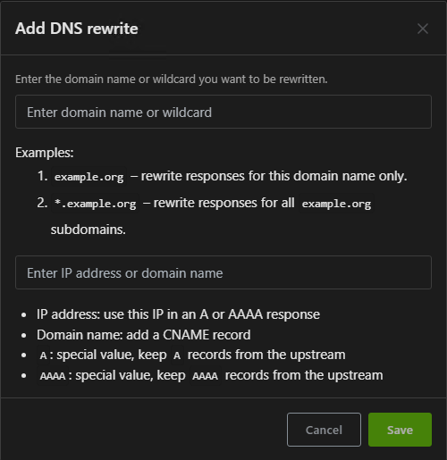

# 🏡 Goug's HomeLab Docker Templates

Welcome to **Goug's HomeLab** — a growing collection of Docker Compose templates for apps I use or test in my HomeLab. These templates are built to help you get up and running quickly with no bloated configs or mysterious dependencies.

Each app folder includes:

* `docker-compose.yml` — core container setup
* `.env` — customizable environment variables
* `README.md` — you're reading it!
* Sample config files (if needed)

Explore more at [goug76/docker-templates](https://github.com/goug76/docker-templates).


---

## 📦 AdGuard Home + Unbound

This setup pairs [AdGuard Home](https://github.com/AdguardTeam/AdGuardHome) with [Unbound](https://github.com/klutchell/unbound-docker) to provide a powerful, privacy-respecting DNS solution.

* **AdGuard Home** blocks ads, trackers, and malicious domains at the DNS level using community blocklists.
* **Unbound** acts as a local recursive DNS resolver, eliminating reliance on upstream providers like Google or Cloudflare.

Together, they form a fast, private, and ad-free DNS pipeline for your entire network.


---

## 🧰 Features

* 🚫 Network-wide ad blocking with detailed logs
* 🔒 Local DNS resolution via Unbound (no third-party DNS)
* 🔧 Simple to customize via web UI or config
* 📊 Query stats and filtering by device or client
* 📡 Supports DNS-over-HTTPS (DoH) and DNS-over-TLS


---

## 🚀 Getting Started

### 🐳 Docker Compose

```yaml
networks:
  networking:
    name: networking
    driver: bridge
    ipam:
      config:
        - subnet: 172.20.0.0/24

services:  
  unbound:
    container_name: unbound
    image: klutchell/unbound
    restart: unless-stopped
    environment:
      - TZ=$TZ
    networks:
      networking:
        ipv4_address: 172.20.0.53 # fixed IP address

  adguardhome: 
    container_name: adguardhome
    image: adguard/adguardhome
    restart: unless-stopped
    ports:
      - 53:53/tcp # DNS
      - 53:53/udp
      - 784:784/udp # DNS over QUIC
      - 853:853/tcp # DNS over TLS
      - 3000:3000/tcp # initial installation
      - 82:80/tcp # Dashboard
      - 4443:443/tcp # DNS over HTTPs
    environment:
      - TZ=$TZ
    volumes:
      - $DOCKERDIR/adguardhome/work:/opt/adguardhome/work
      - $DOCKERDIR/adguardhome/conf:/opt/adguardhome/conf
    networks:
      networking:
        ipv4_address: 172.20.0.54
    depends_on:
      - unbound
```

> ⚠️ Be sure to copy and edit the `.env` file included in this directory.


---

## ⚙️ Environment Variables

| Variable | Description | Example |
|----|----|----|
| `DOCKERDIR` | Docker file Location | `/home/user/docker` |
| `TZ` | Your time zone | `America/New_York` |


---

## 🛠️ Tips & Customization

### Configure Unbound as Upstream DNS Server


1. From the AdGuard home page go to Settings/DNS settings
2. The first section is the Upstream DNS servers, remember we gave Unbound a static IP address go ahead and enter that address in the field `172.20.0.53`

   
3. Scroll down and click `Apply` at the bottom of this section.  Then click `Test upstreams`, if you get a `Working correctly message` you’re good to go.
4. Scroll back to the top and click the `list of know DNS providers`, this will open a new tab with a huge list of DNS providers.  If you remember from setting up my router’s WAN DNS, I used Quad9 and I will set the `Fallback DNS servers` to `https://dns.quad9.net/dns-query`.  Notice the `https` this is `DNS-over-HTTPS` or `DoH`.
5. Next, we need to update the Bootstrap DNS servers IPs to match the new Quad9 DNS provider

   ```none
   9.9.9.9
   149.112.112.112
   2620:fe::fe
   2620:fe::fe:9
   ```
6. Click `Apply` at the bottom of the section.

### DNS Rewrites

DNS rewrites give you fine-grained control over DNS resolution within your network, allowing you to map domain names to internal resources.  For example, if you have a local web server or NAS, you can set `myserver.local` to resolve to its IP address (e.g., `192.168.1.100`), making it easier to access the server by name.  You can even use wildcards such as `*.lab.local`, this will redirect any URL ending with `lab.local` to the destination of your choosing.  This is NOT a feature-rich solution, but gives us the basics we need for our home lab.  Like having a `HOST` file for our network!


1. From the Menu click `Filters/DNS rewrites`
2. Click `Add DNS rewrite`
3. This gives us an easy form to fill out with examples

   
4. Just enter a domain name `*.homelab.local` and point it to the IP address and click `Save`

Now if we navigate to `adguard.homelab.local:82` we should get the log on screen.  We still have to put the port in, but we’ll change that next with Nginx Proxy Manager.

### Configure Blocklists


1. From the Menu click `Filters/DNS blocklists`
2. Click `Add blocklist` then `Choose from the list`, you can add custom blocklists as well.
3. Here you see a whole host of list you can choose from.  They each have a link to their home page and to view the list.  Spend a little time here and see if you like any of these. I’m just going to select `Phishing Army` for now.

### Block Services


1. From the Menu click `Filters/Blocked services`
2. On this screen you have a huge list of services you can block
3. Just select the services you want to block and click `Save`
4. You can even setup a schedule to unblock these services

   


---

## 🧯 Troubleshooting Notes

If you get an error saying that port `53` is already in use


1. Let’s see what’s listening on port 53 type: `sudo lsof -i:53`

   

   
2. We can see it’s `systemd-resolve`
3. To resolve this, we need to open the `resolved.conf` file `sudo nano /etc/systemd/resolved.conf`
4. Uncomment (remove # from the front of the line) the `DNS=`  line and the `DNSStubListener=`  line. Next, change `DNS=127.0.0.1`, and change `DNSStubListener=no`.

  
5. Save the file, press `Ctrl + x`, then type `y` and press `Enter`
6. Then restart the service `sudo service systemd-resolved restart`
7. You should now be able to deploy the stack


---

## 📚 More Info

* [AdGuard Home Docs](https://github.com/adguardteam/adguardhome/wiki/Getting-Started)
* [Unbound Docs](https://hub.docker.com/r/klutchell/unbound)

---

## 🧼 Cleanup

```bash
docker-compose down -v
```


